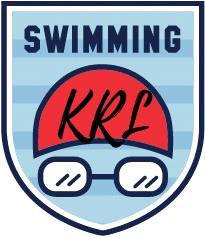

<p align="center">
  <a href="https://docsify.js.org">
    
  </a>
</p>


<p align="center">


</p>


Renang Lestari - Website Lestari Aquatic yang menampilkan kegiatan, pricelist, dan produk.

## Features
- Landing Page
- Catalog course
- Catalog Product

## Struktur Project

```bash
lestari-aquatic/
    ├── src/
    ├── public/
    └── README.md   # Dokumentasi project
```

## Cara Menjalankan


Masuk ke folder `lestari-aquatic`:

```bash
cd lestari-aquatic
```
```bash
npm i
```
```bash
npm run dev
```
`Now, frontend run in http://localhost:5173`
